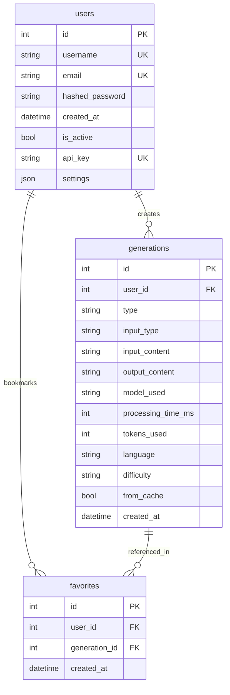
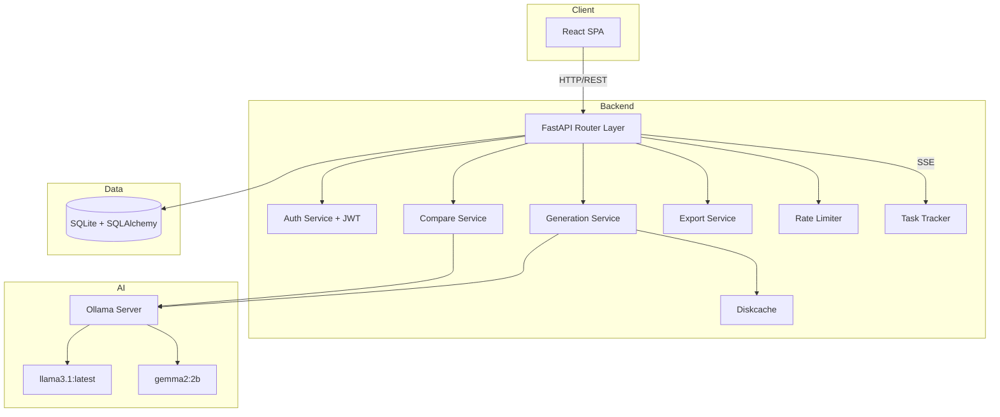

# EduAssist v2 — Technical Design Document

**Project:** Educational AI Assistant (Bachelor's Thesis)
**Version:** 2.0.0
**Date:** 2026-05-21
**Authors:** Student A, Student B
**Stack:** FastAPI · React · Ollama · SQLite · Redis

---

## Table of Contents

1. [Project Structure](#1-project-structure)
2. [Database Schema](#2-database-schema)
3. [API Endpoints](#3-api-endpoints)
4. [Key Implementation Code](#4-key-implementation-code)
5. [Frontend Architecture](#5-frontend-architecture)
6. [Docker Configuration](#6-docker-configuration)
7. [Migration Plan](#7-migration-plan)
8. [Work Division](#8-work-division)
9. [Risk Assessment](#9-risk-assessment)

---

## 1. Project Structure

```
edu-assist/
├── backend/
│   ├── app/
│   │   ├── __init__.py
│   │   ├── main.py                    # FastAPI app factory, middleware, lifespan
│   │   ├── config.py                  # Pydantic Settings from .env
│   │   ├── database.py               # SQLAlchemy engine, session, Base
│   │   ├── models/                   # SQLAlchemy ORM models
│   │   │   ├── __init__.py
│   │   │   ├── user.py
│   │   │   ├── generation.py
│   │   │   └── favorite.py
│   │   ├── schemas/                  # Pydantic request/response schemas
│   │   │   ├── __init__.py
│   │   │   ├── auth.py
│   │   │   ├── user.py
│   │   │   ├── generation.py
│   │   │   ├── export.py
│   │   │   └── common.py
│   │   ├── routers/                  # FastAPI route modules
│   │   │   ├── __init__.py
│   │   │   ├── auth.py               # POST register, login, refresh
│   │   │   ├── users.py              # GET profile, PUT profile
│   │   │   ├── generation.py         # POST summary, flashcards, quiz, keywords, simplify, study-plan
│   │   │   ├── history.py            # GET history, GET history/{id}, DELETE history/{id}
│   │   │   ├── favorites.py          # GET favorites, POST favorites, DELETE favorites/{id}
│   │   │   ├── export.py             # POST export/pdf, /md, /json, /csv, /docx
│   │   │   ├── compare.py            # POST compare (two models side-by-side)
│   │   │   ├── upload.py             # POST upload/file, upload/batch
│   │   │   ├── tasks.py              # GET tasks/{id} (SSE progress)
│   │   │   ├── health.py             # GET health
│   │   │   └── cache.py              # DELETE cache/{type}
│   │   ├── services/                 # Business logic layer
│   │   │   ├── __init__.py
│   │   │   ├── auth_service.py       # JWT creation, password hashing, verification
│   │   │   ├── llm_service.py        # Ollama calls, chunking, retry
│   │   │   ├── generation_service.py # Orchestrates prompts → LLM → save to DB
│   │   │   ├── export_service.py     # PDF, MD, JSON, CSV, DOCX generation
│   │   │   ├── compare_service.py    # Run two models in parallel
│   │   │   ├── file_service.py       # File parsing
│   │   │   ├── history_service.py    # CRUD on generations
│   │   │   └── task_service.py       # Background task tracking
│   │   ├── repositories/             # Data access layer
│   │   │   ├── __init__.py
│   │   │   ├── user_repo.py
│   │   │   ├── generation_repo.py
│   │   │   └── favorite_repo.py
│   │   ├── core/                     # Cross-cutting concerns
│   │   │   ├── __init__.py
│   │   │   ├── security.py           # JWT encode/decode, password utils
│   │   │   ├── dependencies.py       # get_current_user, get_db, rate_limiter
│   │   │   ├── middleware.py         # LoggingMiddleware, ErrorHandlingMiddleware
│   │   │   └── rate_limiter.py       # In-memory sliding window per user
│   │   ├── prompts/
│   │   │   ├── __init__.py
│   │   │   ├── summary.py
│   │   │   ├── flashcards.py
│   │   │   ├── quiz.py
│   │   │   ├── keywords.py
│   │   │   ├── simplify.py
│   │   │   └── study_plan.py
│   │   └── cache.py                  # Diskcache wrapper (kept from v1)
│   ├── alembic/                      # DB migrations
│   │   ├── env.py
│   │   └── versions/
│   │       └── 001_initial.py
│   ├── alembic.ini
│   ├── tests/
│   │   ├── __init__.py
│   │   ├── conftest.py
│   │   ├── test_auth.py
│   │   ├── test_generation.py
│   │   ├── test_history.py
│   │   ├── test_favorites.py
│   │   ├── test_export.py
│   │   ├── test_compare.py
│   │   └── test_rate_limiter.py
│   ├── scripts/
│   │   ├── benchmark.py              # Multi-model benchmark runner
│   │   ├── stress_test.py            # Locust or threading stress test
│   │   └── seed_db.py               # Seed demo data
│   ├── fonts/
│   │   └── DejaVuSans.ttf
│   ├── requirements.txt
│   ├── Dockerfile
│   ├── .env
│   ├── .env.example
│   └── run.py
├── frontend/
│   ├── public/
│   ├── src/
│   │   ├── main.jsx
│   │   ├── App.jsx
│   │   ├── api/
│   │   │   └── client.js            # Axios instance with interceptors
│   │   ├── auth/
│   │   │   ├── AuthContext.jsx       # React context + provider
│   │   │   ├── useAuth.js            # Hook
│   │   │   ├── LoginPage.jsx
│   │   │   └── RegisterPage.jsx
│   │   ├── pages/
│   │   │   ├── DashboardPage.jsx
│   │   │   ├── SummaryPage.jsx
│   │   │   ├── FlashcardsPage.jsx
│   │   │   ├── QuizPage.jsx
│   │   │   ├── HistoryPage.jsx
│   │   │   ├── FavoritesPage.jsx
│   │   │   ├── ComparePage.jsx
│   │   │   ├── SettingsPage.jsx
│   │   │   └── KeywordsPage.jsx
│   │   ├── components/
│   │   │   ├── Navbar.jsx
│   │   │   ├── ProtectedRoute.jsx
│   │   │   ├── GenerationCard.jsx
│   │   │   ├── FlashcardFlip.jsx
│   │   │   ├── QuizRunner.jsx
│   │   │   ├── StatsWidget.jsx
│   │   │   ├── ThemeToggle.jsx
│   │   │   ├── ModelSelector.jsx
│   │   │   └── ProgressIndicator.jsx
│   │   ├── hooks/
│   │   │   ├── useGeneration.js
│   │   │   └── useTheme.js
│   │   ├── styles/
│   │   │   └── theme.css
│   │   └── utils/
│   │       └── formatters.js
│   ├── index.html
│   ├── vite.config.js
│   ├── package.json
│   └── Dockerfile
├── docker-compose.yml
├── docker-compose.dev.yml
├── start.sh
├── .pre-commit-config.yaml
├── docs/
│   ├── API.md
│   ├── DATABASE.md
│   └── BENCHMARKS.md
├── README.md
└── .gitignore
```

---

## 2. Database Schema

### 2.1 ER Diagram (Mermaid)



### 2.2 SQLAlchemy Models

**`app/models/user.py`**

```python
from datetime import datetime, timezone

from sqlalchemy import Boolean, DateTime, Integer, String, Text
from sqlalchemy.orm import Mapped, mapped_column, relationship

from app.database import Base


class User(Base):
    __tablename__ = "users"

    id: Mapped[int] = mapped_column(Integer, primary_key=True, index=True)
    username: Mapped[str] = mapped_column(String(50), unique=True, index=True, nullable=False)
    email: Mapped[str] = mapped_column(String(255), unique=True, index=True, nullable=False)
    hashed_password: Mapped[str] = mapped_column(String(255), nullable=False)
    is_active: Mapped[bool] = mapped_column(Boolean, default=True)
    api_key: Mapped[str | None] = mapped_column(String(64), unique=True, nullable=True)
    settings: Mapped[str | None] = mapped_column(Text, nullable=True)  # JSON string
    created_at: Mapped[datetime] = mapped_column(
        DateTime, default=lambda: datetime.now(timezone.utc)
    )

    generations: Mapped[list["Generation"]] = relationship(
        back_populates="user", cascade="all, delete-orphan"
    )
    favorites: Mapped[list["Favorite"]] = relationship(
        back_populates="user", cascade="all, delete-orphan"
    )
```

**`app/models/generation.py`**

```python
from datetime import datetime, timezone

from sqlalchemy import DateTime, ForeignKey, Integer, String, Text, Boolean
from sqlalchemy.orm import Mapped, mapped_column, relationship

from app.database import Base


class Generation(Base):
    __tablename__ = "generations"

    id: Mapped[int] = mapped_column(Integer, primary_key=True, index=True)
    user_id: Mapped[int] = mapped_column(Integer, ForeignKey("users.id"), index=True, nullable=False)
    type: Mapped[str] = mapped_column(String(20), nullable=False)  # summary | flashcards | quiz | keywords | simplify | study_plan
    input_type: Mapped[str] = mapped_column(String(20), nullable=False)  # text | topic | file
    input_content: Mapped[str] = mapped_column(Text, nullable=False)
    output_content: Mapped[str] = mapped_column(Text, nullable=False)  # JSON string
    model_used: Mapped[str] = mapped_column(String(100), nullable=False)
    processing_time_ms: Mapped[int] = mapped_column(Integer, default=0)
    tokens_used: Mapped[int | None] = mapped_column(Integer, nullable=True)
    language: Mapped[str] = mapped_column(String(5), default="ru")
    difficulty: Mapped[str | None] = mapped_column(String(10), nullable=True)  # easy | medium | hard
    from_cache: Mapped[bool] = mapped_column(Boolean, default=False)
    created_at: Mapped[datetime] = mapped_column(
        DateTime, default=lambda: datetime.now(timezone.utc), index=True
    )

    user: Mapped["User"] = relationship(back_populates="generations")
    favorites: Mapped[list["Favorite"]] = relationship(back_populates="generation")
```

**`app/models/favorite.py`**

```python
from datetime import datetime, timezone

from sqlalchemy import DateTime, ForeignKey, Integer, UniqueConstraint
from sqlalchemy.orm import Mapped, mapped_column, relationship

from app.database import Base


class Favorite(Base):
    __tablename__ = "favorites"
    __table_args__ = (
        UniqueConstraint("user_id", "generation_id", name="uq_user_generation"),
    )

    id: Mapped[int] = mapped_column(Integer, primary_key=True, index=True)
    user_id: Mapped[int] = mapped_column(Integer, ForeignKey("users.id"), nullable=False)
    generation_id: Mapped[int] = mapped_column(
        Integer, ForeignKey("generations.id", ondelete="CASCADE"), nullable=False
    )
    created_at: Mapped[datetime] = mapped_column(
        DateTime, default=lambda: datetime.now(timezone.utc)
    )

    user: Mapped["User"] = relationship(back_populates="favorites")
    generation: Mapped["Generation"] = relationship(back_populates="favorites")
```

### 2.3 SQL DDL (for reference / thesis appendix)

```sql
CREATE TABLE users (
    id         INTEGER PRIMARY KEY AUTOINCREMENT,
    username   VARCHAR(50)  NOT NULL UNIQUE,
    email      VARCHAR(255) NOT NULL UNIQUE,
    hashed_password VARCHAR(255) NOT NULL,
    is_active  BOOLEAN DEFAULT 1,
    api_key    VARCHAR(64) UNIQUE,
    settings   TEXT,  -- JSON
    created_at TIMESTAMP DEFAULT CURRENT_TIMESTAMP
);

CREATE TABLE generations (
    id          INTEGER PRIMARY KEY AUTOINCREMENT,
    user_id     INTEGER NOT NULL REFERENCES users(id),
    type        VARCHAR(20)  NOT NULL,  -- summary, flashcards, quiz, keywords, simplify, study_plan
    input_type  VARCHAR(20)  NOT NULL,  -- text, topic, file
    input_content TEXT NOT NULL,
    output_content TEXT NOT NULL,        -- JSON
    model_used  VARCHAR(100) NOT NULL,
    processing_time_ms INTEGER DEFAULT 0,
    tokens_used INTEGER,
    language    VARCHAR(5) DEFAULT 'ru',
    difficulty  VARCHAR(10),             -- easy, medium, hard
    from_cache  BOOLEAN DEFAULT 0,
    created_at  TIMESTAMP DEFAULT CURRENT_TIMESTAMP
);
CREATE INDEX ix_generations_user_id ON generations(user_id);
CREATE INDEX ix_generations_type ON generations(type);
CREATE INDEX ix_generations_created_at ON generations(created_at);

CREATE TABLE favorites (
    id            INTEGER PRIMARY KEY AUTOINCREMENT,
    user_id       INTEGER NOT NULL REFERENCES users(id),
    generation_id INTEGER NOT NULL REFERENCES generations(id) ON DELETE CASCADE,
    created_at    TIMESTAMP DEFAULT CURRENT_TIMESTAMP,
    UNIQUE(user_id, generation_id)
);
```

---

## 3. API Endpoints

### 3.1 Complete Endpoint Table

| # | Method | Path | Auth | Description |
|---|--------|------|------|-------------|
| 1 | GET | /api/health | No | Health check + Ollama status |
| 2 | POST | /api/auth/register | No | Register new user |
| 3 | POST | /api/auth/login | No | Login, get JWT access+refresh |
| 4 | POST | /api/auth/refresh | Yes | Refresh access token |
| 5 | POST | /api/auth/api-key | Yes | Generate/regenerate API key |
| 6 | GET | /api/users/me | Yes | Get current user profile |
| 7 | PUT | /api/users/me | Yes | Update profile (username, email, settings) |
| 8 | PUT | /api/users/me/password | Yes | Change password |
| 9 | POST | /api/generation/summary | Yes | Generate summary |
| 10 | POST | /api/generation/flashcards | Yes | Generate flashcards |
| 11 | POST | /api/generation/quiz | Yes | Generate quiz |
| 12 | POST | /api/generation/keywords | Yes | Extract keywords from text |
| 13 | POST | /api/generation/simplify | Yes | Simplify text for beginners |
| 14 | POST | /api/generation/study-plan | Yes | Generate study plan |
| 15 | POST | /api/compare | Yes | Compare two models side-by-side |
| 16 | POST | /api/upload/file | Yes | Upload single file, extract text |
| 17 | POST | /api/upload/batch | Yes | Upload multiple files |
| 18 | GET | /api/history | Yes | List user's generations (paginated, filterable) |
| 19 | GET | /api/history/{id} | Yes | Get single generation detail |
| 20 | DELETE | /api/history/{id} | Yes | Delete a generation |
| 21 | GET | /api/favorites | Yes | List user's favorites |
| 22 | POST | /api/favorites | Yes | Add generation to favorites |
| 23 | DELETE | /api/favorites/{id} | Yes | Remove from favorites |
| 24 | POST | /api/export/pdf | Yes | Export to PDF |
| 25 | POST | /api/export/markdown | Yes | Export to Markdown |
| 26 | POST | /api/export/json | Yes | Export to JSON |
| 27 | POST | /api/export/csv | Yes | Export to CSV |
| 28 | POST | /api/export/docx | Yes | Export to DOCX |
| 29 | GET | /api/stats | Yes | User dashboard statistics |
| 30 | DELETE | /api/cache/{type} | Yes | Clear cache |
| 31 | GET | /api/models | Yes | List available Ollama models |
| 32 | GET | /api/tasks/{id} | Yes | SSE stream for task progress |

### 3.2 New Endpoint Details (key ones)

#### POST /api/auth/register

```json
// Request
{
  "username": "student1",
  "email": "student1@university.edu",
  "password": "SecurePass123!"
}

// Response 201
{
  "id": 1,
  "username": "student1",
  "email": "student1@university.edu",
  "created_at": "2026-05-21T10:00:00Z"
}
```

#### POST /api/auth/login

```json
// Request
{
  "username": "student1",  // username OR email
  "password": "SecurePass123!"
}

// Response 200
{
  "access_token": "eyJhbG...",
  "refresh_token": "eyJhbG...",
  "token_type": "bearer",
  "expires_in": 1800
}
```

#### POST /api/generation/quiz (enhanced)

```json
// Request
{
  "text": "Quantum mechanics is...",
  "topic": null,
  "num_questions": 5,
  "language": "en",
  "difficulty": "hard",        // NEW: easy | medium | hard
  "model": "llama3.1:latest",     // NEW: override model
  "temperature": 0.7,          // NEW: override temperature
  "save_to_history": true      // NEW: always true by default
}

// Response 200
{
  "success": true,
  "quiz": [...],
  "generation_id": 42,        // NEW: reference to saved record
  "from_cache": false,
  "processing_time_ms": 2100,
  "tokens_used": 580
}
```

#### POST /api/compare

```json
// Request
{
  "type": "summary",            // summary | flashcards | quiz
  "text": "Long text about AI...",
  "model_a": "llama3.1:latest",
  "model_b": "gemma2:2b",
  "language": "ru",
  "max_points": 7
}

// Response 200
{
  "success": true,
  "result_a": {
    "model": "llama3.1:latest",
    "output": "Summary text from model A...",
    "processing_time_ms": 1200,
    "tokens_used": 400
  },
  "result_b": {
    "model": "gemma2:2b",
    "output": "Summary text from model B...",
    "processing_time_ms": 980,
    "tokens_used": 350
  }
}
```

#### POST /api/generation/keywords

```json
// Request
{
  "text": "Machine learning is a subset of artificial intelligence...",
  "language": "en",
  "max_keywords": 10
}

// Response 200
{
  "success": true,
  "keywords": ["machine learning", "artificial intelligence", "neural networks", "deep learning"],
  "generation_id": 43,
  "processing_time_ms": 800
}
```

#### POST /api/generation/simplify

```json
// Request
{
  "text": "The quantum superposition principle states...",
  "language": "en",
  "target_level": "beginner"   // beginner | child | intermediate
}

// Response 200
{
  "success": true,
  "simplified_text": "Imagine you have a coin spinning in the air...",
  "generation_id": 44,
  "processing_time_ms": 1500
}
```

#### POST /api/generation/study-plan

```json
// Request
{
  "topics": ["Python basics", "Data structures", "OOP"],
  "available_hours": 20,
  "language": "ru",
  "difficulty": "medium"
}

// Response 200
{
  "success": true,
  "study_plan": {
    "total_hours": 20,
    "sessions": [
      {"day": 1, "topic": "Python basics", "hours": 3, "tasks": ["Read chapter 1", "Write 5 functions"]},
      {"day": 2, "topic": "Data structures", "hours": 4, "tasks": ["..."]}
    ]
  },
  "generation_id": 45,
  "processing_time_ms": 2200
}
```

#### GET /api/history

```
GET /api/history?type=quiz&language=en&search=quantum&page=1&per_page=20

// Response 200
{
  "items": [
    {
      "id": 42,
      "type": "quiz",
      "input_type": "text",
      "input_content": "Quantum mechanics...",
      "output_content": "{\"quiz\": [...]}",
      "model_used": "llama3.1:latest",
      "language": "en",
      "difficulty": "hard",
      "processing_time_ms": 2100,
      "is_favorite": true,
      "created_at": "2026-05-21T10:30:00Z"
    }
  ],
  "total": 87,
  "page": 1,
  "per_page": 20,
  "pages": 5
}
```

#### GET /api/stats

```json
// Response 200
{
  "total_generations": 87,
  "by_type": {
    "summary": 30,
    "flashcards": 25,
    "quiz": 20,
    "keywords": 7,
    "simplify": 3,
    "study_plan": 2
  },
  "total_favorites": 12,
  "models_used": {
    "llama3.1:latest": 60,
    "gemma2:2b": 27
  },
  "avg_processing_time_ms": 1450,
  "generations_last_7_days": 23,
  "languages_used": {
    "ru": 70,
    "en": 17
  }
}
```

#### POST /api/export/markdown

```json
// Request
{
  "title": "Summary: AI Basics",
  "content": "Point 1\nPoint 2\nPoint 3",
  "format": "markdown"
}

// Response 200
// Content-Type: text/markdown
// Content-Disposition: attachment; filename="summary_20260521.md"

# Summary: AI Basics

Point 1
Point 2
Point 3
```

---

## 4. Key Implementation Code

### 4.1 Configuration (`app/config.py`)

```python
from pathlib import Path
from functools import lru_cache

from pydantic_settings import BaseSettings


class Settings(BaseSettings):
    # App
    APP_NAME: str = "EduAssist"
    APP_VERSION: str = "2.0.0"
    DEBUG: bool = False
    CORS_ORIGINS: list[str] = ["http://localhost:5173", "http://localhost:3000"]

    # Paths
    BASE_DIR: Path = Path(__file__).resolve().parent.parent
    FONT_DIR: Path = BASE_DIR / "fonts"
    UPLOAD_DIR: Path = BASE_DIR / "uploads"

    # Ollama
    OLLAMA_HOST: str = "http://localhost:11434"
    OLLAMA_MODEL: str = "llama3.1:latest"
    OLLAMA_TIMEOUT: int = 120

    # Chunking
    CHUNK_SIZE: int = 1500
    CHUNK_OVERLAP: int = 200

    # Cache
    CACHE_DIR: Path = BASE_DIR / ".cache"
    CACHE_SIZE_MB: int = 200

    # Database
    DATABASE_URL: str = "sqlite+aiosqlite:///./edu_assist.db"

    # Auth
    JWT_SECRET_KEY: str = "change-me-in-production-use-a-real-secret"
    JWT_ALGORITHM: str = "HS256"
    ACCESS_TOKEN_EXPIRE_MINUTES: int = 30
    REFRESH_TOKEN_EXPIRE_DAYS: int = 7

    # Rate limiting
    RATE_LIMIT_PER_MINUTE: int = 20

    # File upload
    MAX_FILE_SIZE_MB: int = 10

    # Logging
    LOG_LEVEL: str = "INFO"

    model_config = {"env_file": ".env", "env_file_encoding": "utf-8"}


@lru_cache
def get_settings() -> Settings:
    return Settings()
```

### 4.2 Database Setup (`app/database.py`)

```python
from sqlalchemy.ext.asyncio import AsyncSession, async_sessionmaker, create_async_engine
from sqlalchemy.orm import DeclarativeBase

from app.config import get_settings

settings = get_settings()

engine = create_async_engine(
    settings.DATABASE_URL,
    echo=settings.DEBUG,
    connect_args={"check_same_thread": False},  # SQLite only
)

async_session = async_sessionmaker(engine, class_=AsyncSession, expire_on_commit=False)


class Base(DeclarativeBase):
    pass


async def get_db():
    async with async_session() as session:
        try:
            yield session
        finally:
            await session.close()


async def init_db():
    async with engine.begin() as conn:
        await conn.run_sync(Base.metadata.create_all)
```

### 4.3 Security & JWT (`app/core/security.py`)

```python
from datetime import datetime, timedelta, timezone

import jwt
from passlib.context import CryptContext

from app.config import get_settings

settings = get_settings()
pwd_context = CryptContext(schemes=["bcrypt"], deprecated="auto")


def hash_password(password: str) -> str:
    return pwd_context.hash(password)


def verify_password(plain: str, hashed: str) -> bool:
    return pwd_context.verify(plain, hashed)


def create_access_token(data: dict) -> str:
    to_encode = data.copy()
    expire = datetime.now(timezone.utc) + timedelta(minutes=settings.ACCESS_TOKEN_EXPIRE_MINUTES)
    to_encode.update({"exp": expire, "type": "access"})
    return jwt.encode(to_encode, settings.JWT_SECRET_KEY, algorithm=settings.JWT_ALGORITHM)


def create_refresh_token(data: dict) -> str:
    to_encode = data.copy()
    expire = datetime.now(timezone.utc) + timedelta(days=settings.REFRESH_TOKEN_EXPIRE_DAYS)
    to_encode.update({"exp": expire, "type": "refresh"})
    return jwt.encode(to_encode, settings.JWT_SECRET_KEY, algorithm=settings.JWT_ALGORITHM)


def decode_token(token: str) -> dict:
    return jwt.decode(token, settings.JWT_SECRET_KEY, algorithms=[settings.JWT_ALGORITHM])
```

### 4.4 Auth Dependencies (`app/core/dependencies.py`)

```python
import secrets
from fastapi import Depends, HTTPException, status
from fastapi.security import HTTPBearer, HTTPAuthorizationCredentials
from sqlalchemy.ext.asyncio import AsyncSession
from sqlalchemy import select

from app.core.security import decode_token
from app.database import get_db
from app.models.user import User
from app.core.rate_limiter import RateLimiter

security_scheme = HTTPBearer()
rate_limiter = RateLimiter()


async def get_current_user(
    credentials: HTTPAuthorizationCredentials = Depends(security_scheme),
    db: AsyncSession = Depends(get_db),
) -> User:
    try:
        payload = decode_token(credentials.credentials)
        if payload.get("type") != "access":
            raise HTTPException(status_code=401, detail="Invalid token type")
        user_id = payload.get("sub")
    except Exception:
        raise HTTPException(
            status_code=status.HTTP_401_UNAUTHORIZED,
            detail="Could not validate credentials",
        )

    result = await db.execute(select(User).where(User.id == int(user_id)))
    user = result.scalar_one_or_none()
    if not user or not user.is_active:
        raise HTTPException(status_code=401, detail="User not found or inactive")
    return user


async def require_rate_limit(user: User = Depends(get_current_user)) -> User:
    if not rate_limiter.is_allowed(user.id):
        raise HTTPException(status_code=429, detail="Rate limit exceeded. Try again later.")
    return user


def generate_api_key() -> str:
    return f"edu_{secrets.token_hex(24)}"
```

### 4.5 Rate Limiter (`app/core/rate_limiter.py`)

```python
import time
from collections import defaultdict
from threading import Lock

from app.config import get_settings

settings = get_settings()


class RateLimiter:
    """Sliding-window rate limiter, in-memory per user."""

    def __init__(self, max_requests: int | None = None, window_seconds: int = 60):
        self.max_requests = max_requests or settings.RATE_LIMIT_PER_MINUTE
        self.window = window_seconds
        self._requests: dict[int, list[float]] = defaultdict(list)
        self._lock = Lock()

    def is_allowed(self, user_id: int) -> bool:
        now = time.time()
        cutoff = now - self.window
        with self._lock:
            self._requests[user_id] = [
                t for t in self._requests[user_id] if t > cutoff
            ]
            if len(self._requests[user_id]) >= self.max_requests:
                return False
            self._requests[user_id].append(now)
            return True
```

### 4.6 Auth Router (`app/routers/auth.py`)

```python
from fastapi import APIRouter, Depends, HTTPException, status
from sqlalchemy.ext.asyncio import AsyncSession
from sqlalchemy import select

from app.core.security import (
    create_access_token,
    create_refresh_token,
    decode_token,
    hash_password,
    verify_password,
)
from app.core.dependencies import generate_api_key
from app.database import get_db
from app.models.user import User
from app.schemas.auth import RegisterRequest, LoginRequest, TokenResponse
from app.schemas.user import UserOut

router = APIRouter(prefix="/api/auth", tags=["auth"])


@router.post("/register", response_model=UserOut, status_code=201)
async def register(body: RegisterRequest, db: AsyncSession = Depends(get_db)):
    # Check uniqueness
    if (await db.execute(select(User).where(User.username == body.username))).scalar_one_or_none():
        raise HTTPException(400, "Username already exists")
    if (await db.execute(select(User).where(User.email == body.email))).scalar_one_or_none():
        raise HTTPException(400, "Email already exists")

    user = User(
        username=body.username,
        email=body.email,
        hashed_password=hash_password(body.password),
    )
    db.add(user)
    await db.commit()
    await db.refresh(user)
    return user


@router.post("/login", response_model=TokenResponse)
async def login(body: LoginRequest, db: AsyncSession = Depends(get_db)):
    # Allow login by username or email
    result = await db.execute(
        select(User).where((User.username == body.username) | (User.email == body.username))
    )
    user = result.scalar_one_or_none()
    if not user or not verify_password(body.password, user.hashed_password):
        raise HTTPException(401, "Invalid credentials")
    if not user.is_active:
        raise HTTPException(403, "Account disabled")

    access = create_access_token({"sub": str(user.id)})
    refresh = create_refresh_token({"sub": str(user.id)})
    return TokenResponse(
        access_token=access,
        refresh_token=refresh,
        token_type="bearer",
        expires_in=30 * 60,
    )


@router.post("/refresh", response_model=TokenResponse)
async def refresh_token(refresh_token: str, db: AsyncSession = Depends(get_db)):
    try:
        payload = decode_token(refresh_token)
        if payload.get("type") != "refresh":
            raise ValueError()
        user_id = int(payload["sub"])
    except Exception:
        raise HTTPException(401, "Invalid refresh token")

    user = (await db.execute(select(User).where(User.id == user_id))).scalar_one_or_none()
    if not user:
        raise HTTPException(401, "User not found")

    access = create_access_token({"sub": str(user.id)})
    new_refresh = create_refresh_token({"sub": str(user.id)})
    return TokenResponse(
        access_token=access,
        refresh_token=new_refresh,
        token_type="bearer",
        expires_in=30 * 60,
    )


@router.post("/api-key")
async def generate_api_key_endpoint(user: User = Depends(get_current_user), db: AsyncSession = Depends(get_db)):
    user.api_key = generate_api_key()
    await db.commit()
    return {"api_key": user.api_key}


# Import at bottom to avoid circular imports
from app.core.dependencies import get_current_user  # noqa: E402
```

### 4.7 Generation Service (`app/services/generation_service.py`)

```python
import json
import time

from sqlalchemy.ext.asyncio import AsyncSession

from app.core.dependencies import generate_api_key
from app.models.generation import Generation
from app.services.llm_service import call_ollama, get_cache_key
from app.cache import get_from_cache, save_to_cache
from app.prompts.summary import SUMMARY_PROMPT, SUMMARY_TOPIC_PROMPT
from app.prompts.flashcards import FLASHCARD_PROMPT, FLASHCARD_TOPIC_PROMPT
from app.prompts.quiz import QUIZ_PROMPT, QUIZ_TOPIC_PROMPT
from app.prompts.keywords import KEYWORDS_PROMPT
from app.prompts.simplify import SIMPLIFY_PROMPT
from app.prompts.study_plan import STUDY_PLAN_PROMPT


PROMPT_MAP = {
    "summary": {"text": SUMMARY_PROMPT, "topic": SUMMARY_TOPIC_PROMPT},
    "flashcards": {"text": FLASHCARD_PROMPT, "topic": FLASHCARD_TOPIC_PROMPT},
    "quiz": {"text": QUIZ_PROMPT, "topic": QUIZ_TOPIC_PROMPT},
}


async def generate(
    gen_type: str,
    user_id: int,
    input_type: str,
    input_content: str,
    model: str,
    language: str = "ru",
    difficulty: str | None = None,
    save: bool = True,
    db: AsyncSession | None = None,
    **prompt_kwargs,
) -> dict:
    start = time.time()

    # Cache lookup
    cache_key = get_cache_key(gen_type, input_content, model=model, language=language, difficulty=difficulty, **prompt_kwargs)
    cached = get_from_cache(cache_key)

    if cached:
        result = {**cached, "from_cache": True}
    else:
        # Build prompt
        if gen_type in PROMPT_MAP:
            template = PROMPT_MAP[gen_type][input_type]
            prompt = template.format(
                text=input_content if input_type == "text" else "",
                topic=input_content if input_type == "topic" else "",
                language=language,
                difficulty=difficulty or "medium",
                **prompt_kwargs,
            )
        elif gen_type == "keywords":
            prompt = KEYWORDS_PROMPT.format(text=input_content, language=language, **prompt_kwargs)
        elif gen_type == "simplify":
            prompt = SIMPLIFY_PROMPT.format(text=input_content, language=language, **prompt_kwargs)
        elif gen_type == "study_plan":
            prompt = STUDY_PLAN_PROMPT.format(topics=input_content, language=language, difficulty=difficulty or "medium", **prompt_kwargs)
        else:
            raise ValueError(f"Unknown generation type: {gen_type}")

        raw = await call_ollama(prompt, model=model, max_tokens=prompt_kwargs.get("max_tokens", 2000))

        # Parse JSON outputs for structured types
        if gen_type in ("flashcards", "quiz", "keywords", "study_plan"):
            try:
                parsed = json.loads(raw)
            except json.JSONDecodeError:
                # Try extracting JSON from markdown code blocks
                import re
                match = re.search(r'```(?:json)?\s*([\s\S]*?)```', raw)
                if match:
                    parsed = json.loads(match.group(1))
                else:
                    parsed = raw
        else:
            parsed = raw

        processing_time = int((time.time() - start) * 1000)
        result = {
            "output": parsed,
            "from_cache": False,
            "processing_time_ms": processing_time,
        }
        save_to_cache(cache_key, result)

    # Save to history
    if save and db:
        generation = Generation(
            user_id=user_id,
            type=gen_type,
            input_type=input_type,
            input_content=input_content[:5000],  # Truncate large inputs
            output_content=json.dumps(result["output"], ensure_ascii=False) if isinstance(result["output"], (list, dict)) else str(result["output"]),
            model_used=model,
            processing_time_ms=result.get("processing_time_ms", 0),
            language=language,
            difficulty=difficulty,
            from_cache=result["from_cache"],
        )
        db.add(generation)
        await db.commit()
        await db.refresh(generation)
        result["generation_id"] = generation.id

    return result
```

### 4.8 LLM Service (`app/services/llm_service.py`)

```python
import hashlib
from typing import List

import httpx
from tenacity import retry, stop_after_attempt, wait_exponential

from app.config import get_settings

settings = get_settings()


@retry(stop=stop_after_attempt(3), wait=wait_exponential(multiplier=1, min=1, max=10))
async def call_ollama(
    prompt: str,
    model: str | None = None,
    max_tokens: int = 1000,
    temperature: float = 0.3,
) -> str:
    """Call Ollama generate API with a specific model."""
    model = model or settings.OLLAMA_MODEL
    async with httpx.AsyncClient(timeout=settings.OLLAMA_TIMEOUT) as client:
        response = await client.post(
            f"{settings.OLLAMA_HOST}/api/generate",
            json={
                "model": model,
                "prompt": prompt,
                "stream": False,
                "options": {
                    "num_predict": max_tokens,
                    "temperature": temperature,
                },
            },
        )
        response.raise_for_status()
        data = response.json()
        return data.get("response", "").strip()


def chunk_text(
    text: str, chunk_size: int | None = None, overlap: int | None = None
) -> List[str]:
    chunk_size = chunk_size or settings.CHUNK_SIZE
    overlap = overlap or settings.CHUNK_OVERLAP
    if len(text) <= chunk_size:
        return [text]
    chunks = []
    start = 0
    while start < len(text):
        end = min(start + chunk_size, len(text))
        chunks.append(text[start:end])
        start = end - overlap
        if start >= len(text):
            break
    return chunks


def get_cache_key(prefix: str, text: str, **kwargs) -> str:
    content = f"{prefix}:{text}:{sorted(kwargs.items())}"
    return hashlib.md5(content.encode()).hexdigest()


async def list_models() -> list[str]:
    """List models available in Ollama."""
    async with httpx.AsyncClient(timeout=5) as client:
        resp = await client.get(f"{settings.OLLAMA_HOST}/api/tags")
        resp.raise_for_status()
        return [m["name"] for m in resp.json().get("models", [])]
```

### 4.9 App Factory (`app/main.py`)

```python
import logging
import time
from contextlib import asynccontextmanager

from fastapi import FastAPI, Request
from fastapi.middleware.cors import CORSMiddleware
from fastapi.responses import JSONResponse

from app.config import get_settings
from app.database import init_db
from app.core.middleware import LoggingMiddleware
from app.routers import auth, users, generation, history, favorites, export, compare, upload, health, cache, tasks, models as models_router

settings = get_settings()

logging.basicConfig(
    level=settings.LOG_LEVEL,
    format="%(asctime)s | %(levelname)-7s | %(name)s | %(message)s",
)
logger = logging.getLogger("edu_assist")


@asynccontextmanager
async def lifespan(app: FastAPI):
    logger.info("Starting EduAssist v%s", settings.APP_VERSION)
    await init_db()
    settings.UPLOAD_DIR.mkdir(exist_ok=True)
    yield
    logger.info("Shutting down")


app = FastAPI(
    title="EduAssist API",
    version=settings.APP_VERSION,
    lifespan=lifespan,
)

# Middleware
app.add_middleware(LoggingMiddleware)
app.add_middleware(
    CORSMiddleware,
    allow_origins=settings.CORS_ORIGINS,
    allow_credentials=True,
    allow_methods=["*"],
    allow_headers=["*"],
)

# Exception handler
@app.exception_handler(Exception)
async def global_exception_handler(request: Request, exc: Exception):
    logger.exception("Unhandled exception on %s %s", request.method, request.url.path)
    return JSONResponse(
        status_code=500,
        content={"success": False, "error": "Internal server error", "code": "INTERNAL_ERROR"},
    )

# Routers
app.include_router(health.router)
app.include_router(auth.router)
app.include_router(users.router)
app.include_router(generation.router)
app.include_router(history.router)
app.include_router(favorites.router)
app.include_router(export.router)
app.include_router(compare.router)
app.include_router(upload.router)
app.include_router(cache.router)
app.include_router(tasks.router)
app.include_router(models_router.router)
```

### 4.10 Logging Middleware (`app/core/middleware.py`)

```python
import time
import logging

from starlette.middleware.base import BaseHTTPMiddleware
from starlette.requests import Request
from starlette.responses import Response

logger = logging.getLogger("edu_assist.request")


class LoggingMiddleware(BaseHTTPMiddleware):
    async def dispatch(self, request: Request, call_next):
        start = time.time()
        response: Response = await call_next(request)
        duration_ms = int((time.time() - start) * 1000)
        logger.info(
            "%s %s -> %s (%dms)",
            request.method,
            request.url.path,
            response.status_code,
            duration_ms,
        )
        return response
```

### 4.11 Compare Service (`app/services/compare_service.py`)

```python
import asyncio
import time

from app.services.llm_service import call_ollama, get_cache_key
from app.cache import get_from_cache, save_to_cache
from app.prompts.summary import SUMMARY_PROMPT, SUMMARY_TOPIC_PROMPT
from app.prompts.flashcards import FLASHCARD_PROMPT, FLASHCARD_TOPIC_PROMPT
from app.prompts.quiz import QUIZ_PROMPT, QUIZ_TOPIC_PROMPT

PROMPT_MAP = {
    "summary": {"text": SUMMARY_PROMPT, "topic": SUMMARY_TOPIC_PROMPT},
    "flashcards": {"text": FLASHCARD_PROMPT, "topic": FLASHCARD_TOPIC_PROMPT},
    "quiz": {"text": QUIZ_PROMPT, "topic": QUIZ_TOPIC_PROMPT},
}


async def compare_models(
    gen_type: str,
    text: str | None,
    topic: str | None,
    model_a: str,
    model_b: str,
    language: str = "ru",
    **prompt_kwargs,
) -> dict:
    input_text = text or topic
    input_type = "text" if text else "topic"
    template = PROMPT_MAP[gen_type][input_type]

    prompt = template.format(
        text=input_text if input_type == "text" else "",
        topic=input_text if input_type == "topic" else "",
        language=language,
        **prompt_kwargs,
    )

    # Run both models in parallel
    async def run_model(model: str) -> dict:
        start = time.time()
        cache_key = get_cache_key(f"compare_{gen_type}", input_text, model=model, language=language, **prompt_kwargs)
        cached = get_from_cache(cache_key)
        if cached:
            return {**cached, "from_cache": True}
        raw = await call_ollama(prompt, model=model)
        ms = int((time.time() - start) * 1000)
        result = {"model": model, "output": raw, "processing_time_ms": ms, "from_cache": False}
        save_to_cache(cache_key, result)
        return result

    result_a, result_b = await asyncio.gather(
        run_model(model_a), run_model(model_b)
    )

    return {
        "success": True,
        "result_a": result_a,
        "result_b": result_b,
    }
```

### 4.12 Export Service (`app/services/export_service.py`)

```python
import csv
import io
import json
from datetime import datetime

from docx import Document
from reportlab.lib.pagesizes import A4
from reportlab.lib.units import mm
from reportlab.pdfbase import pdfmetrics
from reportlab.pdfbase.ttfonts import TTFont
from reportlab.pdfgen import canvas


def export_pdf(title: str, content: str, author: str = "EduAssist", font_path: str | None = None) -> bytes:
    buffer = io.BytesIO()
    c = canvas.Canvas(buffer, pagesize=A4)
    width, height = A4
    left_margin = 20 * mm
    max_text_width = width - 40 * mm

    font_name = "Helvetica"
    if font_path:
        try:
            pdfmetrics.registerFont(TTFont("DejaVu", font_path))
            font_name = "DejaVu"
        except Exception:
            pass

    c.setFont(font_name, 16)
    c.drawString(left_margin, height - 40 * mm, title)
    c.setFont(font_name, 10)
    c.drawString(left_margin, height - 55 * mm, f"Generated: {datetime.now():%Y-%m-%d %H:%M}")
    c.drawString(left_margin, height - 65 * mm, f"Author: {author}")

    y = height - 85 * mm
    c.setFont(font_name, 11)
    for line in content.split("\n"):
        if y < 50:
            c.showPage()
            c.setFont(font_name, 11)
            y = height - 50
        c.drawString(left_margin, y, line[:120])
        y -= 15

    c.save()
    return buffer.getvalue()


def export_markdown(title: str, content: str) -> str:
    return f"# {title}\n\n{content}\n\n---\n*Generated by EduAssist on {datetime.now():%Y-%m-%d %H:%M}*"


def export_json(title: str, content: str, author: str = "EduAssist") -> str:
    return json.dumps({
        "title": title,
        "content": content,
        "author": author,
        "generated_at": datetime.now().isoformat(),
    }, indent=2, ensure_ascii=False)


def export_csv(title: str, content: str) -> str:
    output = io.StringIO()
    writer = csv.writer(output)
    writer.writerow(["title", "content"])
    writer.writerow([title, content])
    # If content is JSON (flashcards/quiz), flatten
    try:
        data = json.loads(content)
        if isinstance(data, list):
            output = io.StringIO()
            if data and isinstance(data[0], dict):
                writer = csv.DictWriter(output, fieldnames=data[0].keys())
                writer.writeheader()
                writer.writerows(data)
    except (json.JSONDecodeError, TypeError):
        pass
    return output.getvalue()


def export_docx(title: str, content: str, author: str = "EduAssist") -> bytes:
    doc = Document()
    doc.add_heading(title, level=1)
    doc.add_paragraph(f"Generated: {datetime.now():%Y-%m-%d %H:%M}")
    doc.add_paragraph(f"Author: {author}")
    doc.add_paragraph("")
    for line in content.split("\n"):
        if line.startswith("# "):
            doc.add_heading(line[2:], level=2)
        elif line.startswith("- ") or line.startswith("* "):
            doc.add_paragraph(line[2:], style="List Bullet")
        else:
            doc.add_paragraph(line)
    buffer = io.BytesIO()
    doc.save(buffer)
    return buffer.getvalue()
```

### 4.13 New Prompt Templates

**`app/prompts/keywords.py`**

```python
KEYWORDS_PROMPT = """Extract the {max_keywords} most important keywords and key phrases from the following text. Return ONLY a JSON array of strings.

Text: {text}

JSON response:"""
```

**`app/prompts/simplify.py`**

```python
SIMPLIFY_PROMPT = """Rewrite the following text in {language} so that it is easy to understand for a {target_level}. Use simple words, short sentences, and analogies. Keep all important information but make it accessible.

Text: {text}

Simplified text:"""
```

**`app/prompts/study_plan.py`**

```python
STUDY_PLAN_PROMPT = """Create a structured study plan in {language} for the following topics. The student has {available_hours} hours available. Difficulty level: {difficulty}.

Return ONLY a JSON object with:
- "total_hours": total hours in plan
- "sessions": array of objects with "day" (number), "topic" (string), "hours" (number), "tasks" (array of strings)

Topics: {topics}

JSON response:"""
```

**`app/prompts/quiz.py`** (enhanced with difficulty + explanation)

```python
QUIZ_PROMPT = """Create {num_questions} multiple-choice quiz questions at {difficulty} difficulty level in {language} from the following text. Each question must have 4 options and include an "explanation" field explaining why the correct answer is right.

Return ONLY a JSON array. Each item: {{"question": "", "options": ["A","B","C","D"], "correct": 0, "explanation": ""}}

Text: {text}

JSON response:"""

QUIZ_TOPIC_PROMPT = """Create {num_questions} multiple-choice quiz questions at {difficulty} difficulty level in {language} on the topic "{topic}". Each question must have 4 options and include an "explanation" field explaining why the correct answer is right.

Return ONLY a JSON array. Each item: {{"question": "", "options": ["A","B","C","D"], "correct": 0, "explanation": ""}}

JSON response:"""
```

### 4.14 Pydantic Schemas (`app/schemas/auth.py`)

```python
from pydantic import BaseModel, EmailStr, Field


class RegisterRequest(BaseModel):
    username: str = Field(..., min_length=3, max_length=50)
    email: EmailStr
    password: str = Field(..., min_length=8, max_length=128)


class LoginRequest(BaseModel):
    username: str  # accepts username or email
    password: str


class TokenResponse(BaseModel):
    access_token: str
    refresh_token: str
    token_type: str = "bearer"
    expires_in: int
```

### 4.15 Generation Router (`app/routers/generation.py`)

```python
from fastapi import APIRouter, Depends, HTTPException
from sqlalchemy.ext.asyncio import AsyncSession
from pydantic import BaseModel, Field
from typing import Optional

from app.core.dependencies import get_current_user, require_rate_limit
from app.database import get_db
from app.models.user import User
from app.services.generation_service import generate

router = APIRouter(prefix="/api/generation", tags=["generation"])


class GenerationRequest(BaseModel):
    text: Optional[str] = None
    topic: Optional[str] = None
    language: str = "ru"
    difficulty: Optional[str] = None  # easy | medium | hard
    model: Optional[str] = None
    temperature: float = 0.3
    save_to_history: bool = True


class SummaryRequest(GenerationRequest):
    max_points: int = Field(default=7, ge=3, le=20)


class FlashcardsRequest(GenerationRequest):
    num_cards: int = Field(default=5, ge=1, le=20)


class QuizRequest(GenerationRequest):
    num_questions: int = Field(default=5, ge=1, le=20)


class KeywordsRequest(BaseModel):
    text: str
    language: str = "ru"
    model: Optional[str] = None
    max_keywords: int = Field(default=10, ge=3, le=30)


class SimplifyRequest(BaseModel):
    text: str
    language: str = "ru"
    model: Optional[str] = None
    target_level: str = "beginner"  # beginner | child | intermediate


class StudyPlanRequest(BaseModel):
    topics: str  # comma-separated topics
    available_hours: int = Field(default=10, ge=1, le=200)
    language: str = "ru"
    difficulty: str = "medium"
    model: Optional[str] = None


@router.post("/summary")
async def gen_summary(
    body: SummaryRequest,
    user: User = Depends(require_rate_limit),
    db: AsyncSession = Depends(get_db),
):
    if not body.text and not body.topic:
        raise HTTPException(400, detail="text or topic required")
    input_content = body.text or body.topic
    input_type = "text" if body.text else "topic"
    model = body.model or user.settings and "default_model" or "llama3.1:latest"
    result = await generate(
        "summary", user.id, input_type, input_content, model,
        language=body.language, save=body.save_to_history, db=db,
        max_points=body.max_points,
    )
    return {"success": True, **result}


@router.post("/flashcards")
async def gen_flashcards(
    body: FlashcardsRequest,
    user: User = Depends(require_rate_limit),
    db: AsyncSession = Depends(get_db),
):
    if not body.text and not body.topic:
        raise HTTPException(400, detail="text or topic required")
    input_content = body.text or body.topic
    input_type = "text" if body.text else "topic"
    model = body.model or "llama3.1:latest"
    result = await generate(
        "flashcards", user.id, input_type, input_content, model,
        language=body.language, save=body.save_to_history, db=db,
        num_cards=body.num_cards,
    )
    return {"success": True, **result}


@router.post("/quiz")
async def gen_quiz(
    body: QuizRequest,
    user: User = Depends(require_rate_limit),
    db: AsyncSession = Depends(get_db),
):
    if not body.text and not body.topic:
        raise HTTPException(400, detail="text or topic required")
    input_content = body.text or body.topic
    input_type = "text" if body.text else "topic"
    model = body.model or "llama3.1:latest"
    result = await generate(
        "quiz", user.id, input_type, input_content, model,
        language=body.language, difficulty=body.difficulty or "medium",
        save=body.save_to_history, db=db,
        num_questions=body.num_questions,
    )
    return {"success": True, **result}


@router.post("/keywords")
async def gen_keywords(
    body: KeywordsRequest,
    user: User = Depends(require_rate_limit),
    db: AsyncSession = Depends(get_db),
):
    model = body.model or "llama3.1:latest"
    result = await generate(
        "keywords", user.id, "text", body.text, model,
        language=body.language, save=True, db=db,
        max_keywords=body.max_keywords,
    )
    return {"success": True, **result}


@router.post("/simplify")
async def gen_simplify(
    body: SimplifyRequest,
    user: User = Depends(require_rate_limit),
    db: AsyncSession = Depends(get_db),
):
    model = body.model or "llama3.1:latest"
    result = await generate(
        "simplify", user.id, "text", body.text, model,
        language=body.language, save=True, db=db,
        target_level=body.target_level,
    )
    return {"success": True, **result}


@router.post("/study-plan")
async def gen_study_plan(
    body: StudyPlanRequest,
    user: User = Depends(require_rate_limit),
    db: AsyncSession = Depends(get_db),
):
    model = body.model or "llama3.1:latest"
    result = await generate(
        "study_plan", user.id, "topic", body.topics, model,
        language=body.language, difficulty=body.difficulty,
        save=True, db=db,
        available_hours=body.available_hours,
    )
    return {"success": True, **result}
```

### 4.16 History Router (`app/routers/history.py`)

```python
from fastapi import APIRouter, Depends, HTTPException, Query
from sqlalchemy.ext.asyncio import AsyncSession
from sqlalchemy import select, func, desc

from app.core.dependencies import get_current_user
from app.database import get_db
from app.models.user import User
from app.models.generation import Generation
from app.models.favorite import Favorite

router = APIRouter(prefix="/api/history", tags=["history"])


@router.get("")
async def list_history(
    type: str | None = None,
    language: str | None = None,
    search: str | None = None,
    page: int = Query(1, ge=1),
    per_page: int = Query(20, ge=1, le=100),
    user: User = Depends(get_current_user),
    db: AsyncSession = Depends(get_db),
):
    query = select(Generation).where(Generation.user_id == user.id)
    if type:
        query = query.where(Generation.type == type)
    if language:
        query = query.where(Generation.language == language)
    if search:
        query = query.where(Generation.input_content.ilike(f"%{search}%"))

    total = await db.scalar(
        select(func.count()).select_from(query.subquery())
    )
    items = (
        await db.execute(
            query.order_by(desc(Generation.created_at))
            .offset((page - 1) * per_page)
            .limit(per_page)
        )
    ).scalars().all()

    # Check which are favorites
    fav_ids = set(
        r[0] for r in (
            await db.execute(select(Favorite.generation_id).where(Favorite.user_id == user.id))
        ).all()
    )

    return {
        "items": [
            {
                "id": g.id,
                "type": g.type,
                "input_type": g.input_type,
                "input_content": g.input_content[:200],
                "output_content": g.output_content,
                "model_used": g.model_used,
                "language": g.language,
                "difficulty": g.difficulty,
                "processing_time_ms": g.processing_time_ms,
                "is_favorite": g.id in fav_ids,
                "created_at": g.created_at.isoformat(),
            }
            for g in items
        ],
        "total": total,
        "page": page,
        "per_page": per_page,
        "pages": (total + per_page - 1) // per_page,
    }


@router.get("/{generation_id}")
async def get_history_item(
    generation_id: int,
    user: User = Depends(get_current_user),
    db: AsyncSession = Depends(get_db),
):
    gen = (await db.execute(
        select(Generation).where(Generation.id == generation_id, Generation.user_id == user.id)
    )).scalar_one_or_none()
    if not gen:
        raise HTTPException(404, "Generation not found")
    return {
        "id": gen.id,
        "type": gen.type,
        "input_type": gen.input_type,
        "input_content": gen.input_content,
        "output_content": gen.output_content,
        "model_used": gen.model_used,
        "language": gen.language,
        "difficulty": gen.difficulty,
        "processing_time_ms": gen.processing_time_ms,
        "tokens_used": gen.tokens_used,
        "from_cache": gen.from_cache,
        "created_at": gen.created_at.isoformat(),
    }


@router.delete("/{generation_id}", status_code=204)
async def delete_history_item(
    generation_id: int,
    user: User = Depends(get_current_user),
    db: AsyncSession = Depends(get_db),
):
    gen = (await db.execute(
        select(Generation).where(Generation.id == generation_id, Generation.user_id == user.id)
    )).scalar_one_or_none()
    if not gen:
        raise HTTPException(404, "Generation not found")
    await db.delete(gen)
    await db.commit()
```

### 4.17 Favorites Router (`app/routers/favorites.py`)

```python
from fastapi import APIRouter, Depends, HTTPException
from sqlalchemy.ext.asyncio import AsyncSession
from sqlalchemy import select

from app.core.dependencies import get_current_user
from app.database import get_db
from app.models.user import User
from app.models.generation import Generation
from app.models.favorite import Favorite

router = APIRouter(prefix="/api/favorites", tags=["favorites"])


@router.get("")
async def list_favorites(
    user: User = Depends(get_current_user),
    db: AsyncSession = Depends(get_db),
):
    rows = (
        await db.execute(
            select(Favorite, Generation)
            .join(Generation, Favorite.generation_id == Generation.id)
            .where(Favorite.user_id == user.id)
            .order_by(Favorite.created_at.desc())
        )
    ).all()

    return {
        "items": [
            {
                "favorite_id": fav.id,
                "generation_id": gen.id,
                "type": gen.type,
                "input_content": gen.input_content[:200],
                "output_content": gen.output_content,
                "model_used": gen.model_used,
                "language": gen.language,
                "created_at": fav.created_at.isoformat(),
            }
            for fav, gen in rows
        ]
    }


@router.post("", status_code=201)
async def add_favorite(
    generation_id: int,
    user: User = Depends(get_current_user),
    db: AsyncSession = Depends(get_db),
):
    gen = (await db.execute(
        select(Generation).where(Generation.id == generation_id, Generation.user_id == user.id)
    )).scalar_one_or_none()
    if not gen:
        raise HTTPException(404, "Generation not found")

    existing = (await db.execute(
        select(Favorite).where(
            Favorite.user_id == user.id, Favorite.generation_id == generation_id
        )
    )).scalar_one_or_none()
    if existing:
        raise HTTPException(409, "Already in favorites")

    fav = Favorite(user_id=user.id, generation_id=generation_id)
    db.add(fav)
    await db.commit()
    return {"success": True, "favorite_id": fav.id}


@router.delete("/{favorite_id}", status_code=204)
async def remove_favorite(
    favorite_id: int,
    user: User = Depends(get_current_user),
    db: AsyncSession = Depends(get_db),
):
    fav = (await db.execute(
        select(Favorite).where(Favorite.id == favorite_id, Favorite.user_id == user.id)
    )).scalar_one_or_none()
    if not fav:
        raise HTTPException(404, "Favorite not found")
    await db.delete(fav)
    await db.commit()
```

### 4.18 Stats Router (added to `app/routers/users.py`)

```python
from fastapi import APIRouter, Depends
from sqlalchemy.ext.asyncio import AsyncSession
from sqlalchemy import select, func

from app.core.dependencies import get_current_user
from app.database import get_db
from app.models.user import User
from app.models.generation import Generation
from app.models.favorite import Favorite

router = APIRouter(prefix="/api/users", tags=["users"])


@router.get("/me")
async def get_profile(user: User = Depends(get_current_user)):
    return {
        "id": user.id,
        "username": user.username,
        "email": user.email,
        "is_active": user.is_active,
        "settings": user.settings,
        "created_at": user.created_at.isoformat(),
    }


@router.get("/me/stats")
async def get_stats(
    user: User = Depends(get_current_user),
    db: AsyncSession = Depends(get_db),
):
    from datetime import datetime, timedelta, timezone

    total = await db.scalar(
        select(func.count()).select_from(Generation).where(Generation.user_id == user.id)
    )
    favorites_count = await db.scalar(
        select(func.count()).select_from(Favorite).where(Favorite.user_id == user.id)
    )

    # By type
    type_rows = (
        await db.execute(
            select(Generation.type, func.count())
            .where(Generation.user_id == user.id)
            .group_by(Generation.type)
        )
    ).all()
    by_type = {r[0]: r[1] for r in type_rows}

    # By model
    model_rows = (
        await db.execute(
            select(Generation.model_used, func.count())
            .where(Generation.user_id == user.id)
            .group_by(Generation.model_used)
        )
    ).all()

    # Avg processing time
    avg_time = await db.scalar(
        select(func.avg(Generation.processing_time_ms)).where(Generation.user_id == user.id)
    ) or 0

    # Last 7 days
    week_ago = datetime.now(timezone.utc) - timedelta(days=7)
    recent = await db.scalar(
        select(func.count()).select_from(Generation).where(
            Generation.user_id == user.id, Generation.created_at >= week_ago
        )
    )

    # Languages
    lang_rows = (
        await db.execute(
            select(Generation.language, func.count())
            .where(Generation.user_id == user.id)
            .group_by(Generation.language)
        )
    ).all()

    return {
        "total_generations": total,
        "by_type": by_type,
        "total_favorites": favorites_count,
        "models_used": {r[0]: r[1] for r in model_rows},
        "avg_processing_time_ms": int(avg_time),
        "generations_last_7_days": recent,
        "languages_used": {r[0]: r[1] for r in lang_rows},
    }
```

### 4.19 SSE Task Progress (`app/routers/tasks.py`)

```python
import asyncio
import json
from fastapi import APIRouter, Depends
from sse_starlette.sse import EventSourceResponse

from app.core.dependencies import get_current_user
from app.models.user import User
from app.services.task_service import task_tracker

router = APIRouter(prefix="/api/tasks", tags=["tasks"])


@router.get("/{task_id}")
async def stream_task(
    task_id: str,
    user: User = Depends(get_current_user),
):
    async def event_generator():
        while True:
            status = task_tracker.get_status(task_id)
            if status is None:
                yield {"event": "error", "data": json.dumps({"error": "Task not found"})}
                break
            yield {"event": "progress", "data": json.dumps(status)}
            if status.get("status") in ("completed", "failed"):
                yield {"event": "done", "data": json.dumps(status)}
                break
            await asyncio.sleep(0.5)

    return EventSourceResponse(event_generator())
```

**`app/services/task_service.py`**

```python
import threading
from collections import defaultdict
from datetime import datetime


class TaskTracker:
    """In-memory task progress tracker for background jobs."""

    def __init__(self):
        self._tasks: dict[str, dict] = {}
        self._lock = threading.Lock()

    def create(self, task_id: str, total: int = 1) -> dict:
        with self._lock:
            self._tasks[task_id] = {
                "task_id": task_id,
                "status": "pending",
                "progress": 0,
                "total": total,
                "message": "Queued",
                "result": None,
                "started_at": datetime.now().isoformat(),
            }
            return self._tasks[task_id]

    def update(self, task_id: str, progress: int, message: str = "", result=None):
        with self._lock:
            if task_id in self._tasks:
                self._tasks[task_id]["progress"] = progress
                self._tasks[task_id]["message"] = message
                if result is not None:
                    self._tasks[task_id]["result"] = result
                if progress >= self._tasks[task_id]["total"]:
                    self._tasks[task_id]["status"] = "completed"

    def fail(self, task_id: str, error: str):
        with self._lock:
            if task_id in self._tasks:
                self._tasks[task_id]["status"] = "failed"
                self._tasks[task_id]["message"] = error

    def get_status(self, task_id: str) -> dict | None:
        with self._lock:
            return self._tasks.get(task_id)


task_tracker = TaskTracker()
```

### 4.20 Requirements (`requirements.txt`)

```
fastapi==0.115.11
uvicorn[standard]==0.34.0
python-dotenv==1.2.2
pydantic[email]==2.10.6
pydantic-settings==2.7.1
sqlalchemy[asyncio]==2.0.36
aiosqlite==0.20.0
httpx==0.28.1
tenacity==9.0.0
diskcache==5.6.3
passlib[bcrypt]==1.7.4
PyJWT==2.9.0
python-multipart==0.0.20
reportlab==4.5.0
python-docx==1.1.2
PyPDF2==3.0.1
pdfplumber==0.11.4
chardet==5.2.0
sse-starlette==2.1.0
alembic==1.14.0
pytest==8.3.4
pytest-asyncio==0.25.3
httpx  # already included above for test client
```

---

## 5. Frontend Architecture

### 5.1 React Auth Context (`src/auth/AuthContext.jsx`)

```jsx
import { createContext, useState, useEffect, useCallback } from "react";
import api from "../api/client";

export const AuthContext = createContext(null);

export function AuthProvider({ children }) {
  const [user, setUser] = useState(null);
  const [loading, setLoading] = useState(true);

  useEffect(() => {
    const token = localStorage.getItem("access_token");
    if (token) {
      api.get("/api/users/me")
        .then((res) => setUser(res.data))
        .catch(() => localStorage.removeItem("access_token"))
        .finally(() => setLoading(false));
    } else {
      setLoading(false);
    }
  }, []);

  const login = useCallback(async (username, password) => {
    const res = await api.post("/api/auth/login", { username, password });
    localStorage.setItem("access_token", res.data.access_token);
    localStorage.setItem("refresh_token", res.data.refresh_token);
    const profile = await api.get("/api/users/me");
    setUser(profile.data);
  }, []);

  const register = useCallback(async (username, email, password) => {
    await api.post("/api/auth/register", { username, email, password });
  }, []);

  const logout = useCallback(() => {
    localStorage.removeItem("access_token");
    localStorage.removeItem("refresh_token");
    setUser(null);
  }, []);

  return (
    <AuthContext.Provider value={{ user, loading, login, register, logout }}>
      {children}
    </AuthContext.Provider>
  );
}
```

### 5.2 Axios Client with Interceptors (`src/api/client.js`)

```js
import axios from "axios";

const api = axios.create({
  baseURL: "http://localhost:8000",
  headers: { "Content-Type": "application/json" },
});

api.interceptors.request.use((config) => {
  const token = localStorage.getItem("access_token");
  if (token) {
    config.headers.Authorization = `Bearer ${token}`;
  }
  return config;
});

api.interceptors.response.use(
  (response) => response,
  async (error) => {
    const original = error.config;
    if (error.response?.status === 401 && !original._retry) {
      original._retry = true;
      const refreshToken = localStorage.getItem("refresh_token");
      if (refreshToken) {
        try {
          const res = await axios.post("http://localhost:8000/api/auth/refresh", {
            refresh_token: refreshToken,
          });
          localStorage.setItem("access_token", res.data.access_token);
          localStorage.setItem("refresh_token", res.data.refresh_token);
          original.headers.Authorization = `Bearer ${res.data.access_token}`;
          return api(original);
        } catch {
          localStorage.removeItem("access_token");
          localStorage.removeItem("refresh_token");
          window.location.href = "/login";
        }
      }
    }
    return Promise.reject(error);
  }
);

export default api;
```

### 5.3 Protected Route (`src/components/ProtectedRoute.jsx`)

```jsx
import { Navigate } from "react-router-dom";
import { useAuth } from "../auth/useAuth";

export default function ProtectedRoute({ children }) {
  const { user, loading } = useAuth();

  if (loading) return <div className="text-center mt-5"><div className="spinner-border" /></div>;
  if (!user) return <Navigate to="/login" replace />;

  return children;
}
```

### 5.4 App Router (`src/App.jsx`)

```jsx
import { BrowserRouter, Routes, Route } from "react-router-dom";
import { AuthProvider } from "./auth/AuthContext";
import Navbar from "./components/Navbar";
import ProtectedRoute from "./components/ProtectedRoute";
import LoginPage from "./auth/LoginPage";
import RegisterPage from "./auth/RegisterPage";
import DashboardPage from "./pages/DashboardPage";
import SummaryPage from "./pages/SummaryPage";
import FlashcardsPage from "./pages/FlashcardsPage";
import QuizPage from "./pages/QuizPage";
import KeywordsPage from "./pages/KeywordsPage";
import HistoryPage from "./pages/HistoryPage";
import FavoritesPage from "./pages/FavoritesPage";
import ComparePage from "./pages/ComparePage";
import SettingsPage from "./pages/SettingsPage";
import "bootstrap/dist/css/bootstrap.min.css";
import "./styles/theme.css";

export default function App() {
  return (
    <AuthProvider>
      <BrowserRouter>
        <Navbar />
        <div className="container-fluid py-4">
          <Routes>
            <Route path="/login" element={<LoginPage />} />
            <Route path="/register" element={<RegisterPage />} />
            <Route path="/" element={<ProtectedRoute><DashboardPage /></ProtectedRoute>} />
            <Route path="/summary" element={<ProtectedRoute><SummaryPage /></ProtectedRoute>} />
            <Route path="/flashcards" element={<ProtectedRoute><FlashcardsPage /></ProtectedRoute>} />
            <Route path="/quiz" element={<ProtectedRoute><QuizPage /></ProtectedRoute>} />
            <Route path="/keywords" element={<ProtectedRoute><KeywordsPage /></ProtectedRoute>} />
            <Route path="/history" element={<ProtectedRoute><HistoryPage /></ProtectedRoute>} />
            <Route path="/favorites" element={<ProtectedRoute><FavoritesPage /></ProtectedRoute>} />
            <Route path="/compare" element={<ProtectedRoute><ComparePage /></ProtectedRoute>} />
            <Route path="/settings" element={<ProtectedRoute><SettingsPage /></ProtectedRoute>} />
          </Routes>
        </div>
      </BrowserRouter>
    </AuthProvider>
  );
}
```

---

## 6. Docker Configuration

### 6.1 `docker-compose.yml`

```yaml
version: "3.9"

services:
  ollama:
    image: ollama/ollama:latest
    ports:
      - "11434:11434"
    volumes:
      - ollama_data:/root/.ollama
    deploy:
      resources:
        limits:
          memory: 6G

  backend:
    build: ./backend
    ports:
      - "8000:8000"
    environment:
      - OLLAMA_HOST=http://ollama:11434
      - OLLAMA_MODEL=llama3.1:latest
      - OLLAMA_TIMEOUT=120
      - DATABASE_URL=sqlite+aiosqlite:///./edu_assist.db
      - JWT_SECRET_KEY=${JWT_SECRET_KEY:-change-me-in-production}
      - LOG_LEVEL=INFO
      - DEBUG=false
    volumes:
      - backend_data:/app/data
      - backend_cache:/app/.cache
    depends_on:
      - ollama

  frontend:
    build: ./frontend
    ports:
      - "5173:80"
    depends_on:
      - backend

  # Model puller — pulls the model on first start
  ollama-pull:
    image: ollama/ollama:latest
    entrypoint: ["sh", "-c", "ollama pull llama3.1:latest && ollama pull gemma2:2b"]
    depends_on:
      - ollama
    restart: "no"

volumes:
  ollama_data:
  backend_data:
  backend_cache:
```

### 6.2 Backend Dockerfile (`backend/Dockerfile`)

```dockerfile
FROM python:3.13-slim

WORKDIR /app

COPY requirements.txt .
RUN pip install --no-cache-dir -r requirements.txt

COPY . .

RUN mkdir -p /app/data /app/.cache /app/uploads /app/fonts

EXPOSE 8000

CMD ["uvicorn", "app.main:app", "--host", "0.0.0.0", "--port", "8000"]
```

### 6.3 Frontend Dockerfile (`frontend/Dockerfile`)

```dockerfile
FROM node:20-alpine AS build
WORKDIR /app
COPY package*.json ./
RUN npm ci
COPY . .
RUN npm run build

FROM nginx:alpine
COPY --from=build /app/dist /usr/share/nginx/html
COPY nginx.conf /etc/nginx/conf.d/default.conf
EXPOSE 80
CMD ["nginx", "-g", "daemon off;"]
```

### 6.4 `start.sh`

```bash
#!/usr/bin/env bash
set -euo pipefail

echo "=== EduAssist v2 — One-Command Startup ==="

# Check Docker
if ! command -v docker &>/dev/null; then
    echo "ERROR: Docker is not installed. Please install Docker first."
    exit 1
fi

# Check if models exist, pull if not
echo "[1/3] Checking Ollama models..."
docker compose up -d ollama
sleep 5
for model in llama3.1:latest gemma2:2b; do
    if ! docker compose exec ollama ollama list 2>/dev/null | grep -q "$model"; then
        echo "  Pulling $model..."
        docker compose exec ollama ollama pull "$model"
    fi
done

# Start all services
echo "[2/3] Starting all services..."
docker compose up -d --build

# Wait for backend
echo "[3/3] Waiting for backend..."
for i in $(seq 1 30); do
    if curl -s http://localhost:8000/api/health | grep -q "ok"; then
        echo ""
        echo "=== EduAssist is running! ==="
        echo "  Frontend: http://localhost:5173"
        echo "  Backend:  http://localhost:8000"
        echo "  API Docs: http://localhost:8000/docs"
        echo "============================="
        exit 0
    fi
    sleep 2
done

echo "WARNING: Backend health check timed out. Check logs: docker compose logs backend"
```

---

## 7. Migration Plan

### Phase 1: Restructure (Day 1-2)

| Step | Action | Detail |
|------|--------|--------|
| 1.1 | Create directory structure | `models/`, `schemas/`, `routers/`, `services/`, `repositories/`, `core/`, `prompts/` |
| 1.2 | Move existing code | `models.py` → `schemas/common.py`, `prompts.py` → `prompts/*.py`, `llm_client.py` → `services/llm_service.py`, `cache.py` stays, `file_parser.py` → `services/file_service.py` |
| 1.3 | Add database layer | `database.py`, SQLAlchemy models, `alembic/` init |
| 1.4 | Add config upgrade | Replace manual `os.getenv` with Pydantic Settings class |
| 1.5 | Create app factory | Rewrite `main.py` with lifespan, router includes, middleware |
| 1.6 | **Verify** | All existing endpoints still work (no auth yet) |

### Phase 2: Authentication (Day 3-4)

| Step | Action |
|------|--------|
| 2.1 | Add `passlib`, `PyJWT`, `aiosqlite` to requirements |
| 2.2 | Implement `core/security.py` and `core/dependencies.py` |
| 2.3 | Implement `routers/auth.py` (register, login, refresh) |
| 2.4 | Add `get_current_user` dependency to generation endpoints |
| 2.5 | Implement `core/rate_limiter.py` |
| 2.6 | **Test** all auth flows via `/docs` Swagger UI |

### Phase 3: History + Favorites + Stats (Day 5-6)

| Step | Action |
|------|--------|
| 3.1 | Wire `generation_service.py` to save every generation to DB |
| 3.2 | Implement `routers/history.py` |
| 3.3 | Implement `routers/favorites.py` |
| 3.4 | Implement stats endpoint in `routers/users.py` |
| 3.5 | **Test** CRUD operations |

### Phase 4: New AI Features (Day 6-8)

| Step | Action |
|------|--------|
| 4.1 | Add difficulty parameter to quiz prompts |
| 4.2 | Create `prompts/keywords.py`, `prompts/simplify.py`, `prompts/study_plan.py` |
| 4.3 | Add language parameter to all prompts |
| 4.4 | Create `routers/generation.py` with all new endpoints |
| 4.5 | Implement `services/compare_service.py` + `routers/compare.py` |
| 4.6 | **Test** all new generation endpoints |

### Phase 5: Export Enhancement (Day 8-9)

| Step | Action |
|------|--------|
| 5.1 | Create `services/export_service.py` with MD, JSON, CSV, DOCX exporters |
| 5.2 | Create `routers/export.py` with 5 format endpoints |
| 5.3 | **Test** each export format |

### Phase 6: Frontend (Day 4-11, parallel with backend)

| Step | Action |
|------|--------|
| 6.1 | Set up React + Vite + React Router + Bootstrap |
| 6.2 | Implement AuthContext, LoginPage, RegisterPage |
| 6.3 | Implement ProtectedRoute, Navbar |
| 6.4 | Implement DashboardPage (stats cards) |
| 6.5 | Implement SummaryPage, FlashcardsPage, QuizPage |
| 6.6 | Implement KeywordsPage, ComparePage |
| 6.7 | Implement HistoryPage (table with filters) |
| 6.8 | Implement FavoritesPage |
| 6.9 | Implement SettingsPage (model, temperature, theme) |
| 6.10 | Add dark/light theme toggle |
| 6.11 | Responsive design pass |

### Phase 7: Docker + Tests + Docs (Day 10-14)

| Step | Action |
|------|--------|
| 7.1 | Write `Dockerfile` for backend and frontend |
| 7.2 | Write `docker-compose.yml` |
| 7.3 | Write `start.sh` |
| 7.4 | Write pytest tests for all routers |
| 7.5 | Write benchmark script (`scripts/benchmark.py`) |
| 7.6 | Write stress test script (`scripts/stress_test.py`) |
| 7.7 | Update README with architecture diagram |
| 7.8 | Write `docs/API.md`, `docs/DATABASE.md`, `docs/BENCHMARKS.md` |
| 7.9 | Generate Postman collection from OpenAPI |
| 7.10 | Add pre-commit hooks config |

---

## 8. Work Division

### Student A — Backend Architect (70h over 14 days)

| Task | Hours | Days |
|------|-------|------|
| Restructure project + database setup | 10 | 1-2 |
| Auth system (JWT, register/login, dependencies) | 8 | 3-4 |
| History + Favorites + Stats endpoints | 8 | 5-6 |
| New AI features (keywords, simplify, study-plan) | 8 | 6-8 |
| Export service (PDF, MD, JSON, CSV, DOCX) | 6 | 8-9 |
| Compare service | 4 | 9 |
| Docker + docker-compose + start.sh | 6 | 10 |
| Tests (pytest) | 6 | 11-12 |
| Benchmark + stress test scripts | 4 | 12 |
| API documentation (Swagger, Postman) | 4 | 13 |
| Bug fixes + integration testing | 6 | 14 |

### Student B — Frontend Developer (70h over 14 days)

| Task | Hours | Days |
|------|-------|------|
| React project setup (Vite, Router, Bootstrap, axios) | 4 | 1 |
| AuthContext + Login/Register pages | 8 | 1-2 |
| ProtectedRoute + Navbar + theme | 6 | 2-3 |
| Dashboard page (stats widgets) | 6 | 3-4 |
| Summary page | 6 | 4-5 |
| Flashcards page (flip cards) | 6 | 5-6 |
| Quiz page (interactive runner with scoring) | 8 | 6-7 |
| Keywords + Compare pages | 6 | 7-8 |
| History page (table, filters, search) | 8 | 8-9 |
| Favorites page | 4 | 9-10 |
| Settings page (model, temperature, theme) | 4 | 10-11 |
| Responsive design pass + polish | 6 | 11-12 |
| Frontend Dockerfile + nginx config | 2 | 12 |
| End-to-end manual testing | 4 | 13-14 |

### Parallel Work Overlap

```
Day  1  2  3  4  5  6  7  8  9 10 11 12 13 14
A:  [Restructure][  Auth  ][Hist+Fav][New AI ][Export][Cmp][Dckr][Tests][Bnch][Docs][Fix]
B:  [Setup][ Auth  ][Dash][Summary][Flash][Quiz][KW+Cmp][Hist][Fav][Set][Resp][Dckr][Test]
     ^                                                  ^
     |  B starts against v1 endpoints                    |  B switches to v2 endpoints
```

---

## 9. Risk Assessment

| Risk | Likelihood | Impact | Mitigation |
|------|-----------|--------|------------|
| **Ollama model OOM on 8GB RAM** | Medium | High | Use quantized models (Q4); limit `num_predict`; set `OLLAMA_KEEP_ALIVE=5m` in .env; document minimum 8GB with swap |
| **Small LLMs produce invalid JSON** | High | Medium | Add JSON repair in `generation_service.py` (extract from markdown code blocks, strip trailing commas); fallback to raw text response with error flag |
| **SQLite concurrency issues** | Low | Medium | Use `aiosqlite` with WAL mode; for thesis demo, SQLite is fine — add comment about PostgreSQL migration path |
| **Rate limiter lost on restart** | Low | Low | In-memory is acceptable for thesis scope; document Redis migration path for production |
| **Frontend-backend API mismatch** | Medium | Medium | Auto-generate types from OpenAPI schema; maintain `docs/API.md` contract; use Swagger UI for testing |
| **Model pull takes too long on first run** | Medium | Low | `start.sh` pre-pulls models; add progress message; cache models in Docker volume |
| **CORS issues in Docker** | Medium | Medium | Configure CORS origins in `.env`; frontend Dockerfile uses nginx proxy to backend |
| **Disk cache corruption** | Low | Low | Diskcache handles this; add `clear_cache` endpoint as escape hatch; wrap in try/except |
| **bcrypt slow on ARM/slow CPU** | Low | Low | Use `passlib` with auto-detected backend; for dev, can use argon2 as alternative |
| **Thesis defense: "why not GPT-4?"** | N/A | N/A | Document: (1) data privacy — no data leaves local machine, (2) cost — zero per-query cost, (3) reproducibility — any student can run it, (4) benchmark table showing local models are sufficient for educational content generation |

### Fallback Options

| If... | Then... |
|-------|---------|
| Ollama won't start in Docker | Fall back to host-installed Ollama; expose via host network |
| 8GB RAM not enough for 2 models | Use only llama3.2:1b or phi3:mini; benchmark section shows trade-offs |
| SQLite too slow | Switch `DATABASE_URL` to PostgreSQL; add `psycopg2-binary` to requirements |
| JSON parsing fails >20% of time | Add structured output mode: prompt with "respond with valid JSON only" + add `json` format param to Ollama API call |
| React dev server issues | Use Vite preview mode or serve from nginx; both work in Docker |

---

## Appendix A: Benchmark Table Template

| Model | Params | Quantization | Summary (s) | Flashcards (s) | Quiz (s) | Quality (1-5) | RAM (MB) |
|-------|--------|-------------|-------------|-----------------|----------|---------------|----------|
| llama3.1:latest | 3B | Q4_K_M | 12.3 | 8.7 | 15.2 | 4.0 | 2400 |
| gemma2:2b | 2B | Q4_0 | 8.1 | 5.9 | 10.4 | 3.5 | 1600 |
| phi3:mini | 3.8B | Q4 | 10.8 | 7.2 | 12.9 | 3.8 | 2200 |
| vikhr-llama:1b | 1B | Q8 | 4.2 | 3.1 | 6.8 | 3.0 | 900 |

## Appendix B: Architecture Diagram (Mermaid)


